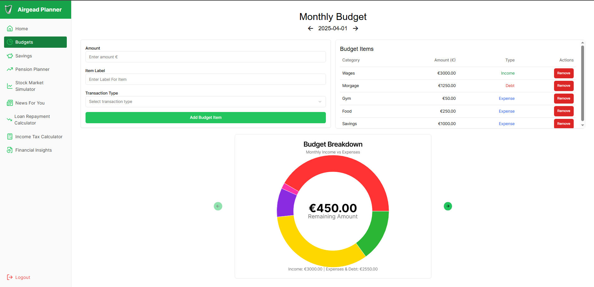
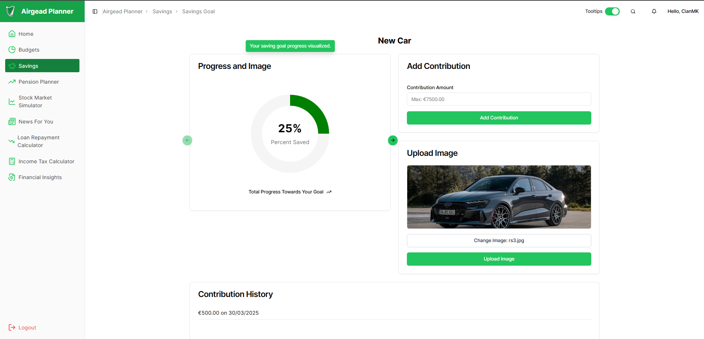
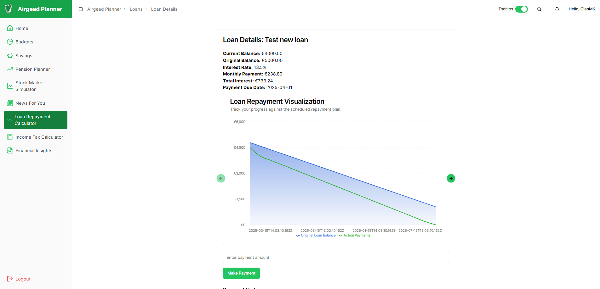
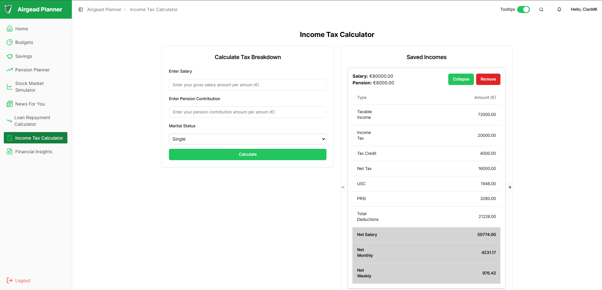
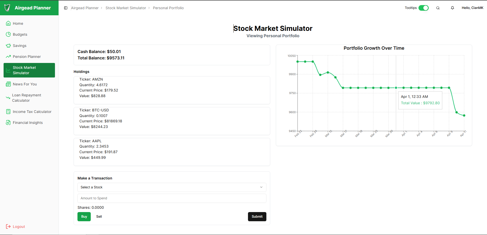
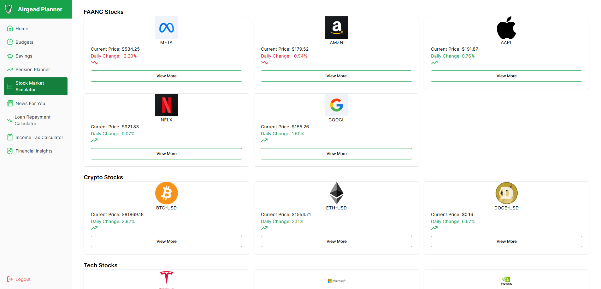
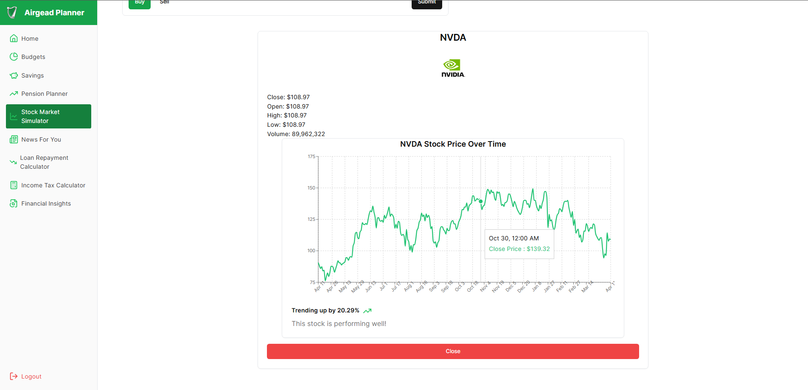
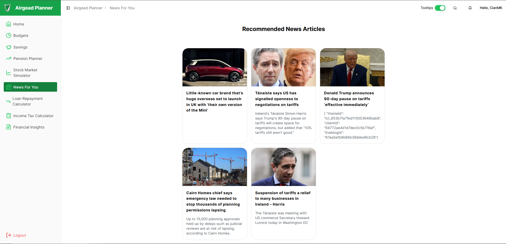
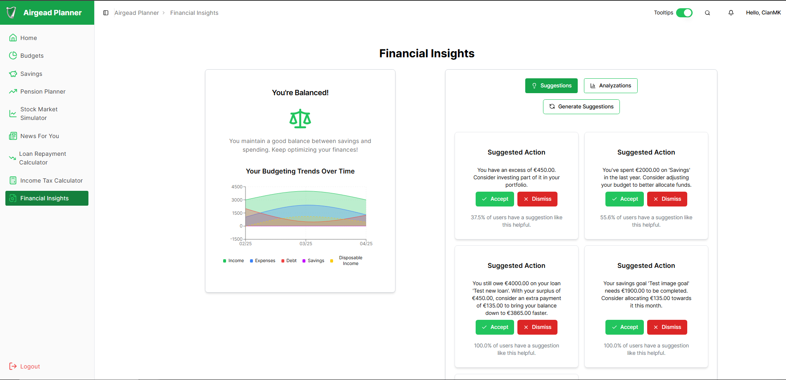
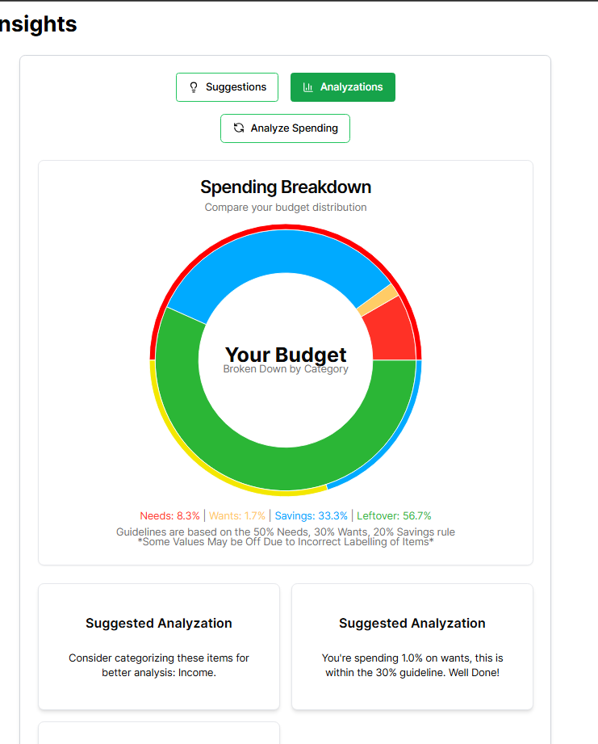

# Airgead Planner

Final Year Project for **TU856 BSc Computer Science**  
Creator: Cian McKenna  
Supervisor: Deirdre Lawless  
Technological University Dublin

Airgead Planner is a dynamic, full-stack web application built to improve financial literacy and empower young adults in Ireland to take control of their personal finances through visualization, simulation, and gamification. This project is publically accesible at airgeadplaner.com

---

## Overview

Many young adults rely on fragmented tools like spreadsheets, limited banking apps, or expensive subscription services for managing finances. Airgead Planner addresses this by offering a **centralized**, **educational**, and **interactive** platform built around the Irish financial landscape.

The app integrates core financial tools in one intuitive interface including:

- Monthly and Custom Budgeting
- Savings Goal Tracking
- Loan Repayment Planning
- Income Tax Breakdown
- Pension Forecasting
- Real-Time Stock Market Simulation
- Personalized Financial News Feed
- Financial Insights, Suggestions and Analysations Based on User Data

---

## Tech Stack

| Layer        | Technology              |
|-------------|--------------------------|
| Frontend    | React (TypeScript), Tailwind CSS, Node |
| Backend     | Django (Django Rest Framework) |
| Auth        | Django Knox (Token-based) |
| Database    | PostgreSQL               |
| External APIs | Yahoo Finance (stock data), newsdata.io (financial news) |
| Deployment | AWS EC2, Nginx |

---

## Installation

### Prerequisites

- Node.js & npm
- Python 3.10+
- PostgreSQL

### Setup Instructions

1. **Clone the Repository**
   ```bash
   git clone https://github.com/yourusername/airgead_planner.git
   cd airgead_planner
   ```

2. **Frontend Setup**
   ```bash
   cd frontend
   npm install
   npm run dev
   ```

3. **Backend Setup**
   ```bash
   cd backend
   python -m venv env
   source env/bin/activate
   pip install -r requirements.txt
   python manage.py migrate
   python manage.py runserver
   ```

4. **Environment Variables**
   Set up your `.env` files for:
   - Django secret key
   - API keys for Yahoo Finance and newsdata.io

---

## Key Features

### Authentication
- User sign up, login, logout, password reset
- Token-based session handling with protected routes

### Monthly Budgeting
- Add/remove custom items
- Navigate through historical budgets
- Visual spending breakdown via charts


### Saving Goals
- Create and track progress towards goals
- Visual milestone breakdown
- Custom image upload


### Loan Repayment
- Enter loan details and view repayment breakdown
- Visual comparison of interest vs. principal


### Income Tax Breakdown
- Enter salary and view net vs. gross income along with detailed tax breakdowns
- Visual comparison of two income levels with tax effects


### Stock Market Simulator
- Simulated $10,000 trading account
- Real-time stock data updated every 30 mins
- Buy/sell stock functionality
- Friend leagues and rankings




### Personalized News Feed
- Irish financial news
- Content-based recommendation based on user interests and user spending habits


### Collaboration Tools
- Shareable Budgets
- Sharable Savings Goals
- Stock Trading Shared Leagues

### Financial Insights
- Users classifed into categories based on historical budgets
- Suggested Actions based on current budget
- Current budget analysations



---

## Testing

- **Frontend**: Playwright e2e testing
- **Backend**: Django `unittest` module
- **API**: Postman
- **Usability Testing**: Two rounds of user testing using Think-Aloud Method

---

## 🔍 Methodology

The project follows **Feature-Driven Development (FDD)**
---

## ⚠ Disclaimer

Airgead Planner is an educational tool only. It does not provide professional financial advice or connect to real bank accounts.

